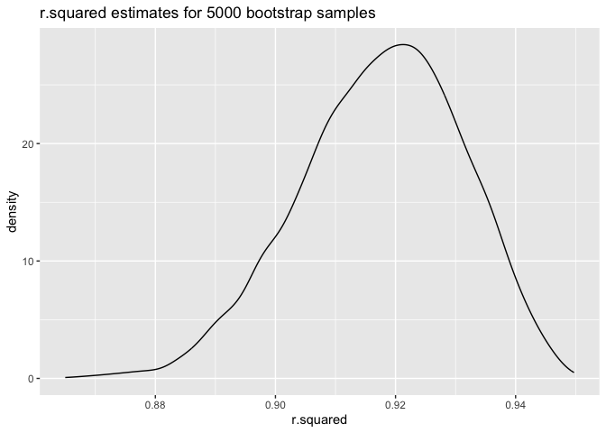
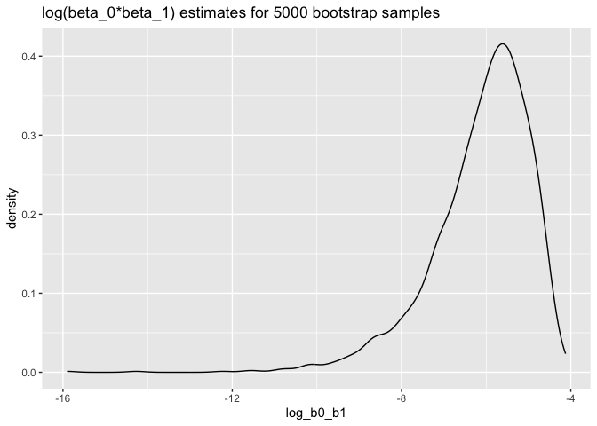

p8105_hw6_zx2482
================
Allison Xia
2023-12-02

``` r
library(readr)
library(dplyr)
```

    ## 
    ## Attaching package: 'dplyr'

    ## The following objects are masked from 'package:stats':
    ## 
    ##     filter, lag

    ## The following objects are masked from 'package:base':
    ## 
    ##     intersect, setdiff, setequal, union

``` r
library(stringr)
library(modelr)
library(tidyverse)
```

    ## ── Attaching core tidyverse packages ──────────────────────── tidyverse 2.0.0 ──
    ## ✔ forcats   1.0.0     ✔ purrr     1.0.2
    ## ✔ ggplot2   3.4.3     ✔ tibble    3.2.1
    ## ✔ lubridate 1.9.2     ✔ tidyr     1.3.0

    ## ── Conflicts ────────────────────────────────────────── tidyverse_conflicts() ──
    ## ✖ dplyr::filter() masks stats::filter()
    ## ✖ dplyr::lag()    masks stats::lag()
    ## ℹ Use the conflicted package (<http://conflicted.r-lib.org/>) to force all conflicts to become errors

## Problem 1

    ## Rows: 52179 Columns: 12
    ## ── Column specification ────────────────────────────────────────────────────────
    ## Delimiter: ","
    ## chr (9): uid, victim_last, victim_first, victim_race, victim_age, victim_sex...
    ## dbl (3): reported_date, lat, lon
    ## 
    ## ℹ Use `spec()` to retrieve the full column specification for this data.
    ## ℹ Specify the column types or set `show_col_types = FALSE` to quiet this message.

``` r
# Create a city_state variable
homicide_data <- homicide_data %>%
  mutate(city_state = paste(city, state, sep = ", "))

# Create a binary variable for solved homicides
homicide_data <- homicide_data %>%
  mutate(solved_binary = ifelse(disposition == "Closed by arrest", 1, 0))

# Omit specified cities
homicide_data <- homicide_data %>%
  filter(!(city_state %in% c("Dallas, TX", "Phoenix, AZ", "Kansas City, MO", "Tulsa, AL"))) 

# Limit analysis to cases where victim_race is white or black
homicide_data <- homicide_data %>%
  filter(victim_race %in% c("White", "Black"))

# Ensure victim_age is numeric
homicide_data$victim_age <- as.numeric(homicide_data$victim_age)
```

    ## Warning: NAs introduced by coercion

``` r
# View the modified dataset
head(homicide_data)
```

    ## # A tibble: 6 × 14
    ##   uid   reported_date victim_last victim_first victim_race victim_age victim_sex
    ##   <chr>         <dbl> <chr>       <chr>        <chr>            <dbl> <chr>     
    ## 1 Alb-…      20100601 SATTERFIELD VIVIANA      White               15 Female    
    ## 2 Alb-…      20100102 MULA        VIVIAN       White               72 Female    
    ## 3 Alb-…      20100126 BOOK        GERALDINE    White               91 Female    
    ## 4 Alb-…      20100130 MARTIN-LEY… GUSTAVO      White               56 Male      
    ## 5 Alb-…      20100218 LUJAN       KEVIN        White               NA Male      
    ## 6 Alb-…      20100308 GRAY        STEFANIA     White               43 Female    
    ## # ℹ 7 more variables: city <chr>, state <chr>, lat <dbl>, lon <dbl>,
    ## #   disposition <chr>, city_state <chr>, solved_binary <dbl>

``` r
# Filter data for Baltimore, MD
baltimore_data <- homicide_data %>%
  filter(city_state == "Baltimore, MD")

# Fit logistic regression model
model <- glm(solved_binary ~ victim_age + victim_sex + victim_race, 
             data = baltimore_data, family = binomial())

# Extract adjusted odds ratio for male vs female victims
# Calculate OR confidence interval
model |> 
  broom::tidy() |> 
  mutate(
    OR = exp(estimate), 
    OR_CI_upper = exp(estimate + 1.96 * std.error),
    OR_CI_lower = exp(estimate - 1.96 * std.error)) |> 
  filter(term == "victim_sexMale") |> 
  select(OR, OR_CI_lower, OR_CI_upper) |>
  knitr::kable(digits = 3)
```

|    OR | OR_CI_lower | OR_CI_upper |
|------:|------------:|------------:|
| 0.426 |       0.325 |       0.558 |

Below, by incorporating `nest()`, `map()`, and `unnest()` into the
preceding Baltimore-specific code, we fit a model for each of the
cities, and extract the adjusted odds ratio (and CI) for solving
homicides comparing non-white victims to white victims. We show the
first 5 rows of the resulting dataframe of model results.

``` r
model_results = 
  homicide_data |> 
  nest(data = -city_state) |> 
  mutate(
    models = map(data, \(df) glm(solved_binary ~ victim_age + victim_sex + victim_race, 
                             family = binomial(), data = df)),
    tidy_models = map(models, broom::tidy)) |> 
  select(-models, -data) |> 
  unnest(cols = tidy_models) |> 
  mutate(
    OR = exp(estimate), 
    OR_CI_upper = exp(estimate + 1.96 * std.error),
    OR_CI_lower = exp(estimate - 1.96 * std.error)) |> 
  filter(term == "victim_sexMale") |> 
  select(city_state, OR, OR_CI_lower, OR_CI_upper)

model_results |>
  slice(1:5) |> 
  knitr::kable(digits = 3)
```

| city_state      |    OR | OR_CI_lower | OR_CI_upper |
|:----------------|------:|------------:|------------:|
| Albuquerque, NM | 1.767 |       0.831 |       3.761 |
| Atlanta, GA     | 1.000 |       0.684 |       1.463 |
| Baltimore, MD   | 0.426 |       0.325 |       0.558 |
| Baton Rouge, LA | 0.381 |       0.209 |       0.695 |
| Birmingham, AL  | 0.870 |       0.574 |       1.318 |

Below we generate a plot of the estimated ORs and CIs for each city,
ordered by magnitude of the OR from smallest to largest. From this plot
we see that most cities have odds ratios that are smaller than 1,
suggesting that crimes with male victims have smaller odds of resolution
compared to crimes with female victims after adjusting for victim age
and race. This disparity is strongest in New yrok. In roughly half of
these cities, confidence intervals are narrow and do not contain 1,
suggesting a significant difference in resolution rates by sex after
adjustment for victim age and race.

``` r
model_results |> 
  mutate(city_state = fct_reorder(city_state, OR)) |> 
  ggplot(aes(x = city_state, y = OR)) + 
  geom_point() + 
  geom_errorbar(aes(ymin = OR_CI_lower, ymax = OR_CI_upper)) + 
  theme(axis.text.x = element_text(angle = 90, hjust = 1))
```

<!-- -->

## Problem 2

``` r
weather_df = 
  rnoaa::meteo_pull_monitors(
    c("USW00094728"),
    var = c("PRCP", "TMIN", "TMAX"), 
    date_min = "2022-01-01",
    date_max = "2022-12-31") |>
  mutate(
    name = recode(id, USW00094728 = "CentralPark_NY"),
    tmin = tmin / 10,
    tmax = tmax / 10) |>
  select(name, id, everything())
```

    ## using cached file: /Users/allisonxia/Library/Caches/org.R-project.R/R/rnoaa/noaa_ghcnd/USW00094728.dly

    ## date created (size, mb): 2023-12-02 17:24:48.986897 (8.544)

    ## file min/max dates: 1869-01-01 / 2023-11-30

``` r
str(weather_df)
```

    ## tibble [365 × 6] (S3: tbl_df/tbl/data.frame)
    ##  $ name: chr [1:365] "CentralPark_NY" "CentralPark_NY" "CentralPark_NY" "CentralPark_NY" ...
    ##  $ id  : chr [1:365] "USW00094728" "USW00094728" "USW00094728" "USW00094728" ...
    ##  $ date: Date[1:365], format: "2022-01-01" "2022-01-02" ...
    ##  $ prcp: num [1:365] 201 10 0 0 58 0 97 0 25 0 ...
    ##  $ tmax: num [1:365] 13.3 15 2.8 1.1 8.3 5 1.1 -1 4.4 4.4 ...
    ##  $ tmin: num [1:365] 10 2.8 -5.5 -7.1 -0.5 1.1 -3.8 -6.6 -1.6 -4.3 ...

``` r
set.seed(1202)

boot_sample = function(df) {
  sample_frac(df, replace = TRUE)
}

weather_samples = 
  tibble(strap_number = 1:5000) |> 
  mutate(
    strap_sample = map(strap_number, \(i) boot_sample(df = weather_df)),
    models=map(strap_sample,\(df) lm(tmax~tmin+prcp,data=df))
  )
```

``` r
r_squared_estimates = 
  weather_samples |> 
  mutate(
    results=map(models,broom::glance)
  )|>
  select(-strap_sample,-models)|>
  unnest(results)|>
  select(strap_number,r.squared)
```

``` r
r_squared_estimates |> 
ggplot(aes(x =r.squared))+
  geom_density()+
  labs(
    title="r.squared estimates for 5000 bootstrap samples"
  )
```

<!-- -->

``` r
log_estimates = 
  weather_samples|>
  mutate(
    models=map(strap_sample,\(df) lm(tmax~tmin+prcp,data=df)),
    results=map(models,broom::tidy)
  )|>
  select(-strap_sample,-models)|>
  unnest(results)|>
  select(strap_number,term,estimate)|>
  filter(term %in% c("tmin","prcp"))|>
  group_by(strap_number)|>
  summarise(log_b0_b1=log(prod(estimate)))
```

    ## Warning: There were 3355 warnings in `summarise()`.
    ## The first warning was:
    ## ℹ In argument: `log_b0_b1 = log(prod(estimate))`.
    ## ℹ In group 1: `strap_number = 1`.
    ## Caused by warning in `log()`:
    ## ! NaNs produced
    ## ℹ Run `dplyr::last_dplyr_warnings()` to see the 3354 remaining warnings.

``` r
log_estimates |> 
  ggplot(aes(x=log_b0_b1))+
  geom_density()+
  labs(
    title="log(beta_0*beta_1) estimates for 5000 bootstrap samples"
  )
```

    ## Warning: Removed 3355 rows containing non-finite values (`stat_density()`).

<!-- -->

``` r
r_squared_CI = quantile(pull(r_squared_estimates,r.squared),c(0.025,0.975))
log_CI = quantile(pull(log_estimates,log_b0_b1),c(0.025,0.975),na.rm=TRUE)
```

The distribution of $\hat{r}^2$ exhibits a peak around 0.92 and shows a
left-skewed pattern, which indicates that a majority of the data points
have $\hat{r}^2$ values close to 1,and 95% CI is 0.8893891, 0.9410766.
Such a distribution suggests that the variables `tmin` and `prcp`
effectively explain a significant proportion of the variance in `tmax`.

The distribution of $log(\hat{\beta_0*\beta_1})$ has a peak around -6
and is also left-skewed. There are 3355 instances of NaN values,
accounting for approximately 67.1% of the 5000 bootstrap samples. These
NaNs arise due to the negative products of $\hat{\beta_0*\beta_1}$.
Considering the remaining valid estimates, all the logarithmic values
are negative, with the 95% confidence interval -8.9896466, -4.5598663.
This indicates that the estimated product of the coefficients is
below 1. The negative values in this interaction suggest that the
combined effect of `tmin` and `prcp` on `tmax` is lesser than the
product of their individual effects

## Problem 3

``` r
url_2 = "https://p8105.com/data/birthweight.csv"

birthweight = read_csv(url_2)
```

    ## Rows: 4342 Columns: 20
    ## ── Column specification ────────────────────────────────────────────────────────
    ## Delimiter: ","
    ## dbl (20): babysex, bhead, blength, bwt, delwt, fincome, frace, gaweeks, malf...
    ## 
    ## ℹ Use `spec()` to retrieve the full column specification for this data.
    ## ℹ Specify the column types or set `show_col_types = FALSE` to quiet this message.

``` r
str(birthweight)
```

    ## spc_tbl_ [4,342 × 20] (S3: spec_tbl_df/tbl_df/tbl/data.frame)
    ##  $ babysex : num [1:4342] 2 1 2 1 2 1 2 2 1 1 ...
    ##  $ bhead   : num [1:4342] 34 34 36 34 34 33 33 33 36 33 ...
    ##  $ blength : num [1:4342] 51 48 50 52 52 52 46 49 52 50 ...
    ##  $ bwt     : num [1:4342] 3629 3062 3345 3062 3374 ...
    ##  $ delwt   : num [1:4342] 177 156 148 157 156 129 126 140 146 169 ...
    ##  $ fincome : num [1:4342] 35 65 85 55 5 55 96 5 85 75 ...
    ##  $ frace   : num [1:4342] 1 2 1 1 1 1 2 1 1 2 ...
    ##  $ gaweeks : num [1:4342] 39.9 25.9 39.9 40 41.6 ...
    ##  $ malform : num [1:4342] 0 0 0 0 0 0 0 0 0 0 ...
    ##  $ menarche: num [1:4342] 13 14 12 14 13 12 14 12 11 12 ...
    ##  $ mheight : num [1:4342] 63 65 64 64 66 66 72 62 61 64 ...
    ##  $ momage  : num [1:4342] 36 25 29 18 20 23 29 19 13 19 ...
    ##  $ mrace   : num [1:4342] 1 2 1 1 1 1 2 1 1 2 ...
    ##  $ parity  : num [1:4342] 3 0 0 0 0 0 0 0 0 0 ...
    ##  $ pnumlbw : num [1:4342] 0 0 0 0 0 0 0 0 0 0 ...
    ##  $ pnumsga : num [1:4342] 0 0 0 0 0 0 0 0 0 0 ...
    ##  $ ppbmi   : num [1:4342] 26.3 21.3 23.6 21.8 21 ...
    ##  $ ppwt    : num [1:4342] 148 128 137 127 130 115 105 119 105 145 ...
    ##  $ smoken  : num [1:4342] 0 0 1 10 1 0 0 0 0 4 ...
    ##  $ wtgain  : num [1:4342] 29 28 11 30 26 14 21 21 41 24 ...
    ##  - attr(*, "spec")=
    ##   .. cols(
    ##   ..   babysex = col_double(),
    ##   ..   bhead = col_double(),
    ##   ..   blength = col_double(),
    ##   ..   bwt = col_double(),
    ##   ..   delwt = col_double(),
    ##   ..   fincome = col_double(),
    ##   ..   frace = col_double(),
    ##   ..   gaweeks = col_double(),
    ##   ..   malform = col_double(),
    ##   ..   menarche = col_double(),
    ##   ..   mheight = col_double(),
    ##   ..   momage = col_double(),
    ##   ..   mrace = col_double(),
    ##   ..   parity = col_double(),
    ##   ..   pnumlbw = col_double(),
    ##   ..   pnumsga = col_double(),
    ##   ..   ppbmi = col_double(),
    ##   ..   ppwt = col_double(),
    ##   ..   smoken = col_double(),
    ##   ..   wtgain = col_double()
    ##   .. )
    ##  - attr(*, "problems")=<externalptr>

``` r
# Convert numeric variables to factors
birthweight =
  birthweight |> 
  mutate(babysex = factor(babysex, levels = c(1, 2), labels = c("Male", "Female")),
         frace = factor(frace, levels = c(1, 2, 3, 4, 8, 9), labels = c("White", "Black", "Asian", "Puerto Rican", "Other", "Unknown")),
         malform = factor(malform, levels = c(0, 1), labels = c("Absent", "Present")),
         mrace = factor(mrace, levels = c(1, 2, 3, 4, 8), labels = c("White", "Black", "Asian", "Puerto Rican", "Other"))
  )
```

``` r
birthweight = na.omit(birthweight)
```
