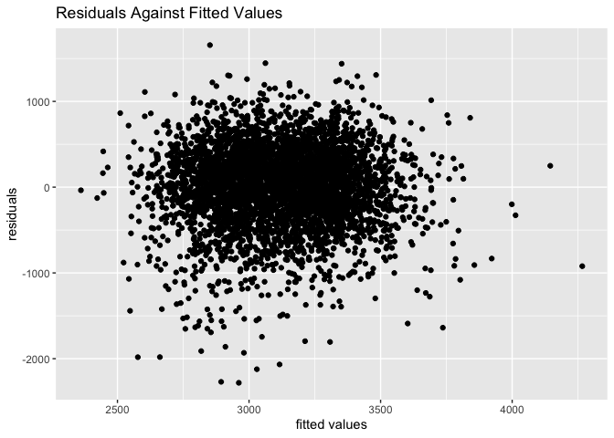

p8105_hw6_zx2482
================
Allison Xia
2023-12-02

## Problem 1

``` r
# Create a city_state variable
homicide_data <- homicide_data |> 
  mutate(city_state = paste(city, state, sep = ", "))

# Create a binary variable for solved homicides
homicide_data <- homicide_data |>
  mutate(solved_binary = ifelse(disposition == "Closed by arrest", 1, 0))

# Omit specified cities
homicide_data <- homicide_data |>
  filter(!(city_state %in% c("Dallas, TX", "Phoenix, AZ", "Kansas City, MO", "Tulsa, AL"))) 

# Limit analysis to cases where victim_race is white or black
homicide_data <- homicide_data |>
  filter(victim_race %in% c("White", "Black"))

# Ensure victim_age is numeric
homicide_data$victim_age <- as.numeric(homicide_data$victim_age)

# View the modified dataset
head(homicide_data)
```

    ## # A tibble: 6 × 14
    ##   uid   reported_date victim_last victim_first victim_race victim_age victim_sex
    ##   <chr>         <dbl> <chr>       <chr>        <chr>            <dbl> <chr>     
    ## 1 Alb-…      20100601 SATTERFIELD VIVIANA      White               15 Female    
    ## 2 Alb-…      20100102 MULA        VIVIAN       White               72 Female    
    ## 3 Alb-…      20100126 BOOK        GERALDINE    White               91 Female    
    ## 4 Alb-…      20100130 MARTIN-LEY… GUSTAVO      White               56 Male      
    ## 5 Alb-…      20100218 LUJAN       KEVIN        White               NA Male      
    ## 6 Alb-…      20100308 GRAY        STEFANIA     White               43 Female    
    ## # ℹ 7 more variables: city <chr>, state <chr>, lat <dbl>, lon <dbl>,
    ## #   disposition <chr>, city_state <chr>, solved_binary <dbl>

``` r
# Filter data for Baltimore, MD
baltimore_data <- homicide_data |>
  filter(city_state == "Baltimore, MD")

# Fit logistic regression model
model <- glm(solved_binary ~ victim_age + victim_sex + victim_race, 
             data = baltimore_data, family = binomial())

# Extract adjusted odds ratio for male vs female victims
# Calculate OR confidence interval
model |> 
  broom::tidy() |> 
  mutate(
    OR = exp(estimate), 
    OR_CI_upper = exp(estimate + 1.96 * std.error),
    OR_CI_lower = exp(estimate - 1.96 * std.error)) |> 
  filter(term == "victim_sexMale") |> 
  select(OR, OR_CI_lower, OR_CI_upper) |>
  knitr::kable(digits = 3)
```

|    OR | OR_CI_lower | OR_CI_upper |
|------:|------------:|------------:|
| 0.426 |       0.325 |       0.558 |

Below, by incorporating `nest()`, `map()`, and `unnest()` into the
preceding Baltimore-specific code, we fit a model for each of the
cities, and extract the adjusted odds ratio (and CI) for solving
homicides comparing non-white victims to white victims. We show the
first 5 rows of the resulting dataframe of model results.

``` r
model_results = 
  homicide_data |> 
  nest(data = -city_state) |> 
  mutate(
    models = map(data, \(df) glm(solved_binary ~ victim_age + victim_sex + victim_race, 
                             family = binomial(), data = df)),
    tidy_models = map(models, broom::tidy)) |> 
  select(-models, -data) |> 
  unnest(cols = tidy_models) |> 
  mutate(
    OR = exp(estimate), 
    OR_CI_upper = exp(estimate + 1.96 * std.error),
    OR_CI_lower = exp(estimate - 1.96 * std.error)) |> 
  filter(term == "victim_sexMale") |> 
  select(city_state, OR, OR_CI_lower, OR_CI_upper)

model_results |>
  slice(1:5) |> 
  knitr::kable(digits = 3)
```

| city_state      |    OR | OR_CI_lower | OR_CI_upper |
|:----------------|------:|------------:|------------:|
| Albuquerque, NM | 1.767 |       0.831 |       3.761 |
| Atlanta, GA     | 1.000 |       0.684 |       1.463 |
| Baltimore, MD   | 0.426 |       0.325 |       0.558 |
| Baton Rouge, LA | 0.381 |       0.209 |       0.695 |
| Birmingham, AL  | 0.870 |       0.574 |       1.318 |

Below we generate a plot of the estimated ORs and CIs for each city,
ordered by magnitude of the OR from smallest to largest. From this plot
we see that most cities have odds ratios that are smaller than 1,
suggesting that crimes with male victims have smaller odds of resolution
compared to crimes with female victims after adjusting for victim age
and race. This disparity is strongest in New yrok. In roughly half of
these cities, confidence intervals are narrow and do not contain 1,
suggesting a significant difference in resolution rates by sex after
adjustment for victim age and race.

``` r
model_results |> 
  mutate(city_state = fct_reorder(city_state, OR)) |> 
  ggplot(aes(x = city_state, y = OR)) + 
  geom_point() + 
  geom_errorbar(aes(ymin = OR_CI_lower, ymax = OR_CI_upper)) + 
  theme(axis.text.x = element_text(angle = 90, hjust = 1))
```

<!-- -->

## Problem 2

``` r
weather_df = 
  rnoaa::meteo_pull_monitors(
    c("USW00094728"),
    var = c("PRCP", "TMIN", "TMAX"), 
    date_min = "2022-01-01",
    date_max = "2022-12-31") |>
  mutate(
    name = recode(id, USW00094728 = "CentralPark_NY"),
    tmin = tmin / 10,
    tmax = tmax / 10) |>
  select(name, id, everything())
str(weather_df)
```

    ## tibble [365 × 6] (S3: tbl_df/tbl/data.frame)
    ##  $ name: chr [1:365] "CentralPark_NY" "CentralPark_NY" "CentralPark_NY" "CentralPark_NY" ...
    ##  $ id  : chr [1:365] "USW00094728" "USW00094728" "USW00094728" "USW00094728" ...
    ##  $ date: Date[1:365], format: "2022-01-01" "2022-01-02" ...
    ##  $ prcp: num [1:365] 201 10 0 0 58 0 97 0 25 0 ...
    ##  $ tmax: num [1:365] 13.3 15 2.8 1.1 8.3 5 1.1 -1 4.4 4.4 ...
    ##  $ tmin: num [1:365] 10 2.8 -5.5 -7.1 -0.5 1.1 -3.8 -6.6 -1.6 -4.3 ...

``` r
set.seed(1202)

boot_sample = function(df) {
  sample_frac(df, replace = TRUE)
}

weather_samples = 
  tibble(strap_number = 1:5000) |> 
  mutate(
    strap_sample = map(strap_number, \(i) boot_sample(df = weather_df)),
    models=map(strap_sample,\(df) lm(tmax~tmin+prcp,data=df))
  )
```

``` r
r_squared_estimates = 
  weather_samples |> 
  mutate(
    results=map(models,broom::glance)
  )|>
  select(-strap_sample,-models)|>
  unnest(results)|>
  select(strap_number,r.squared)
```

``` r
r_squared_estimates |> 
ggplot(aes(x =r.squared))+
  geom_density()+
  labs(
    title="r.squared estimates for 5000 bootstrap samples"
  )
```

<!-- -->

``` r
log_estimates = 
  weather_samples|>
  mutate(
    models=map(strap_sample,\(df) lm(tmax~tmin+prcp,data=df)),
    results=map(models,broom::tidy)
  )|>
  select(-strap_sample,-models)|>
  unnest(results)|>
  select(strap_number,term,estimate)|>
  filter(term %in% c("tmin","prcp"))|>
  group_by(strap_number)|>
  summarise(log_b0_b1=log(prod(estimate)))
```

``` r
log_estimates |> 
  ggplot(aes(x=log_b0_b1))+
  geom_density()+
  labs(
    title="log(beta_0*beta_1) estimates for 5000 bootstrap samples"
  )
```

<!-- -->

``` r
r_squared_CI = quantile(pull(r_squared_estimates,r.squared),c(0.025,0.975))
log_CI = quantile(pull(log_estimates,log_b0_b1),c(0.025,0.975),na.rm=TRUE)
```

The distribution of $\hat{r}^2$ exhibits a peak around 0.92 and shows a
left-skewed pattern, which indicates that a majority of the data points
have $\hat{r}^2$ values close to 1,and 95% CI is 0.8893891, 0.9410766.
Such a distribution suggests that the variables `tmin` and `prcp`
effectively explain a significant proportion of the variance in `tmax`.

The distribution of $log(\hat{\beta_0*\beta_1})$ has a peak around -6
and is also left-skewed. There are 3355 instances of NaN values,
accounting for approximately 67.1% of the 5000 bootstrap samples. These
NaNs arise due to the negative products of $\hat{\beta_0*\beta_1}$.
Considering the remaining valid estimates, all the logarithmic values
are negative, with the 95% confidence interval -8.9896466, -4.5598663.
This indicates that the estimated product of the coefficients is
below 1. The negative values in this interaction suggest that the
combined effect of `tmin` and `prcp` on `tmax` is lesser than the
product of their individual effects

## Problem 3

``` r
url_2 = "https://p8105.com/data/birthweight.csv"

birthweight = read_csv(url_2)
```

``` r
# Convert numeric variables to factors
birthweight =
  birthweight |> 
  mutate(babysex = factor(babysex, levels = c(1, 2), labels = c("Male", "Female")),
         frace = factor(frace, levels = c(1, 2, 3, 4, 8, 9), labels = c("White", "Black", "Asian", "Puerto Rican", "Other", "Unknown")),
         malform = factor(malform, levels = c(0, 1), labels = c("Absent", "Present")),
         mrace = factor(mrace, levels = c(1, 2, 3, 4, 8), labels = c("White", "Black", "Asian", "Puerto Rican", "Other"))
  ) |> 
  na.omit()
```

I hypothesize that factors like the mother’s health (BMI, weight gain
during pregnancy), lifestyle choices (smoking), and demographics (age,
race), and baby’s sex significantly impact the baby’s birth weight.

``` r
lm_bwt = lm(bwt ~ ppbmi + wtgain + smoken + momage + mrace + babysex, data = birthweight)
summary(lm_bwt)
```

    ## 
    ## Call:
    ## lm(formula = bwt ~ ppbmi + wtgain + smoken + momage + mrace + 
    ##     babysex, data = birthweight)
    ## 
    ## Residuals:
    ##      Min       1Q   Median       3Q      Max 
    ## -2281.16  -257.09    24.58   298.45  1656.52 
    ## 
    ## Coefficients:
    ##                    Estimate Std. Error t value Pr(>|t|)    
    ## (Intercept)       2491.5820    65.0496  38.303  < 2e-16 ***
    ## ppbmi               22.3820     2.2248  10.060  < 2e-16 ***
    ## wtgain              12.3415     0.6422  19.216  < 2e-16 ***
    ## smoken             -11.8743     0.9714 -12.224  < 2e-16 ***
    ## momage               5.8912     1.9495   3.022  0.00253 ** 
    ## mraceBlack        -348.3187    15.8776 -21.938  < 2e-16 ***
    ## mraceAsian        -146.2865    71.4246  -2.048  0.04061 *  
    ## mracePuerto Rican -224.3429    31.4005  -7.145 1.05e-12 ***
    ## babysexFemale      -73.4026    13.9350  -5.267 1.45e-07 ***
    ## ---
    ## Signif. codes:  0 '***' 0.001 '**' 0.01 '*' 0.05 '.' 0.1 ' ' 1
    ## 
    ## Residual standard error: 457.9 on 4333 degrees of freedom
    ## Multiple R-squared:  0.2022, Adjusted R-squared:  0.2007 
    ## F-statistic: 137.2 on 8 and 4333 DF,  p-value: < 2.2e-16

``` r
birthweight |> 
  add_predictions(lm_bwt) |> 
  add_residuals(lm_bwt)|>
  ggplot(aes(x = pred, y = resid)) + 
  geom_point()+
  labs(
    title="Residuals Against Fitted Values",
    x="fitted values",
    y="residuals"
  )
```

<!-- -->

``` r
set.seed(222) # For reproducibility

# 100 resamples
cv_data = 
  crossv_mc(birthweight, 100) |> 
  mutate(
    train=map(train,as_tibble),
    test=map(test,as_tibble)
  )

# Calculate RMSE for each model
rmse = 
  cv_data |> 
  mutate(
    my_mod  = map(train, \(df) lm_bwt),
    alt_mod_1  = map(train, \(df) lm(bwt ~ blength + gaweeks, data = df)),
    alt_mod_2  = map(train, \(df) lm(bwt ~ bhead*blength*babysex, data=df)),
    rmse_my_mod = map2_dbl(.x=my_mod, .y=test, ~rmse(model = .x, data = .y)),
    rmse_alt_mod_1 = map2_dbl(.x=alt_mod_1, .y=test, ~rmse(model = .x, data = .y)),
    rmse_alt_mod_2 = map2_dbl(.x=alt_mod_2, .y=test, ~rmse(model = .x, data = .y))
    )

# Compare models
rmse |> 
  summarise(across(starts_with("rmse"), mean))
```

    ## # A tibble: 1 × 3
    ##   rmse_my_mod rmse_alt_mod_1 rmse_alt_mod_2
    ##         <dbl>          <dbl>          <dbl>
    ## 1        455.           333.           290.

Based on the cross-validation results, the second alternative model –
the one that incorporates head circumference, length, sex, and all their
interactions – emerges as the top performer. This model achieves the
lowest root mean square error (RMSE), indicating its superior accuracy
in predictions relative to both my initial model and the first
alternative model.
